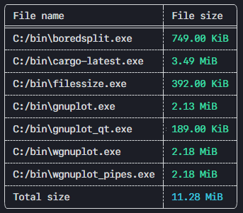

<div align = "center"><h1>Filessize</h1></div>

<h3 align = "center">Cli tool for checking size of files</h3>

[](https://github.com/clowzed/filessize/actions/workflows/rust.yml)


<div align = "center">

</div>

<br>
<br>
<h2 align = "center">Installation</h2>


- From `crates.io`
```bash
cargo install filessize
```

- Manually

```
cd /tmp
git clone https://github.com/clowzed/filessize.git
cd filessize
cargo build --release
mv ./target/release/filessize /your/bin/dir
```

<h2 align = "center">Running</h2>

```bash
filessize <any-pattern> <another-pattern> <or-filename>
```
 